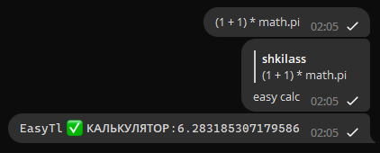

# EasyTl documentation

## **EN** How to use EasyTl

### Commands usage rules
From the `EasyTl v1.4.0` all commands MUST use the argument parser. It has a specific syntax:

1. All commands must start with the prefix to use it. Prefixes available in default translations:
    **EN** translation: `easy`, `ez`
    **RU** translation: `easy`, `ez`, `изи`
    **UK** translation: `easy`, `ez`, `изи`, `ізі`
    You can use any from it. Examples:
        `easy pass`
        `ez pass`
        `изи пасс`
        `ізі пас`
   (About the command `pass` see [here](../plugins/core-plugin.md#pass-command))
2. All arguments are **STRONGLY** separated by SPACES. It doesn't allow to use SPACES in arguments.
3. To use SPACES in arguments you must use the quotes. Example:
    `easy calc "1 + 1"`
    If you wouldn't use the quotes:
    `easy calc 1 + 1`
    Argument parser will be thought that are three arguments. EasyTl will give you an error.
    (About the command `calc` see [here](../plugins/core-plugin.md#calculator-command))
4. To use quotes in quotes you can use `\\` symbol:
    `easy gsearch "inurl: \"dog\" cute"`
    You can also use `'` this quote:
    `easy gsearch 'inurl: "dog" cute'`
    These commands are give one result.

Also, commands may support the "reply-to-message" usage. It is means that command can work if you reply by it command to any message. 
Example:

That's all! Thank you for usage my project.
If you want to help me just donate to the ukrainian military [there](https://savelife.in.ua/en/donate-en). 
Any sum can help to save life and peace in Ukraine.

## **RU** Как использовать Изител

### Правила использования команд
С версии `EasyTl v1.4.0` все команды обязаны использовать парсер аргументов. Он имеет специфический синтаксис:

1. Все команды должны начинаться с префикса для их использования. Доступные префиксы в встроенных переводах:
    **EN** англ. перевод: `easy`, `ez`
    **RU** рус.  перевод: `easy`, `ez`, `изи`
    **UK** укр.  перевод: `easy`, `ez`, `изи`, `ізі`
    Вы можете использовать любой из них. Примеры:
        `easy pass`
        `ez pass`
        `изи пасс`
        `ізі пас`
   (Про команду `pass` смотрите [здесь](../plugins/core-plugin.md#команда-пасс))
2. Все аргументы **СТРОГО** разделены ПРОБЕЛАМИ. Это не разрешает использовать ПРОБЕЛЫ в аргументах.
3. Чтобы использовать ПРОБЕЛЫ вы должны использовать кавычки. Пример:
    `изи обчисл "1 + 1"`
    Если вы не будете использовать кавычки:
    `изи обчисл 1 + 1`
    Парсер аргументов посчитает что здесь три аргумента. Изител выдаст вам ошибку.
    (Про команду `обчисл` смотрите [здесь](../plugins/core-plugin.md#команда-обчисл))
4. Чтобы использовать кавычки в кавычках вы можете использовать символ `\\`:
    `изи найти "inurl: \"собака\" мило"`
    Вы также можете использовать `'` эту кавычку:
    `изи найти 'inurl: "собака" мило'`
    Данные команды выдают один результат.

Также, команды могут использовать "поддержку ответом на сообщение". Это означает, что команда может работать если вы ответите ей на определённое сообщение. 
Пример:

Это всё! Спасибо за использование моего проекта.
Если вы хотите помочь мне, вы можете задонатить военным силам Украины [здесь](https://savelife.in.ua/en/donate-en). 
Любая сумма поможет сохранить жизни и мир в Украине.